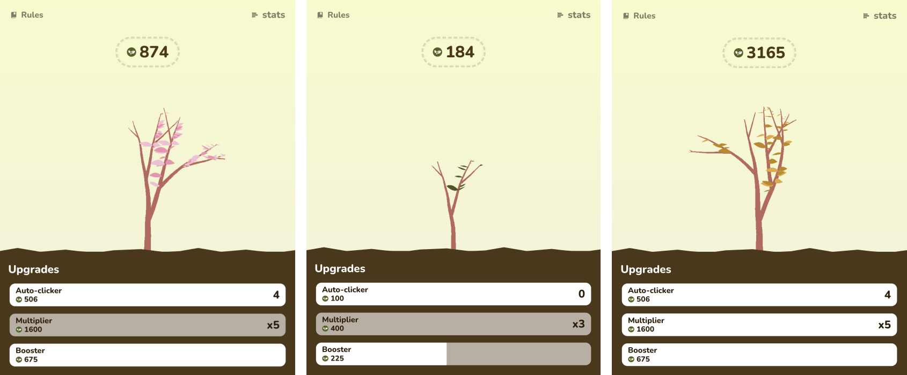

# Plant Clicker



## Demo

[Plant Clicker](https://louis-va.github.io/plant-clicker/)

## Projet Description

This project involves creating a "Cookie Clicker" game. As a team, we develop a _Cookie Clicker_ with features such as a <u>click counter</u>, <u>multipliers</u>, <u>purchase costs</u>, <u>automatic upgrades</u>, and bonuses. We'll ensure that the player cannot achieve a negative score and enhance the user interface for an appealing look.

## Skills Development

The primary goal of this project is to use pure JavaScript to collaborate effectively within our team. We will face various challenges related to _teamwork_, including _time management_, _resolving Git conflicts_, and _efficient coordination among team members_.

## Tech Stack

**Front-End:** JS, HTML, CSS, [Pixi.js](https://pixijs.com/), [seedrandom](https://github.com/davidbau/seedrandom)

**Development Tools** : Vite, Prettier, ESLint

<!-- GETTING STARTED -->
# Getting Started

## Prerequisites

You need to have node and npm installed on your machine to run this project locally.  

### npm
```sh
npm install npm@latest -g
```

## Installation

### 1. Clone the repo
```sh
git clone git@github.com:louis-va/restaurant-css-framework.git
```
### 2. Install NPM packages
```sh
npm install
```

## Execution 
```sh
npm run dev
```
